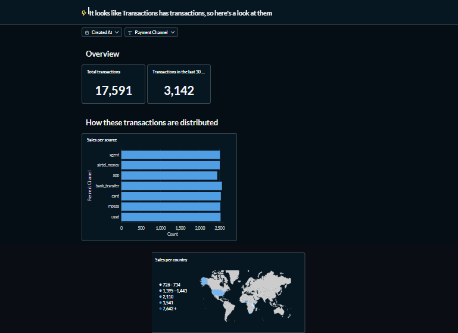
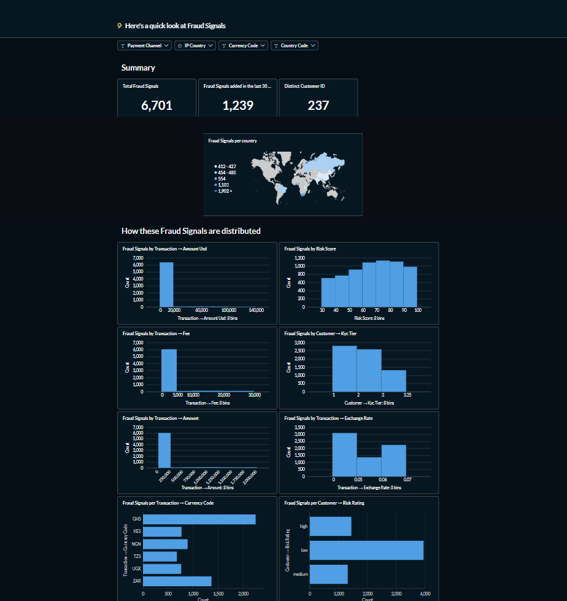

# ZamuPay Data Engine — Real-Time African Fintech Data Pipeline

A simulated, real-time fintech data pipeline built to model wallet transactions, fraud
signals, and multi-currency payments across six African markets (Kenya, Nigeria, Ghana,
South Africa, Tanzania, Uganda) plus US/UK. The project mirrors the kind of data
infrastructure used by mobile money and digital wallet providers, end-to-end: from
synthetic transaction generation through to dashboards used for monitoring and fraud
analysis.

Built as a hands-on companion to my work in data engineering and IT audit at a
multi-country fintech group — this is a sandboxed, fully synthetic environment for
exploring pipeline design, schema modeling, and BI/fraud-monitoring patterns.

## Architecture

```
┌──────────────────┐      ┌───────────┐      ┌────────────┐      ┌───────────┐
│  Python Generator │ ───▶ │ PostgreSQL │ ───▶ │   Kafka /   │ ───▶ │  Metabase  │
│ (Faker-driven)     │      │  (core DB) │      │ Kafka Connect│      │ dashboards │
└──────────────────┘      └───────────┘      └────────────┘      └───────────┘
```

| Service | Role |
|---|---|
| **postgres** | Core relational store — customers, wallets, merchants, transactions, fraud signals, exchange rates |
| **zookeeper / kafka / kafka-connect** | Streaming backbone for change-data-capture / event distribution off the transactions table |
| **kafka-ui** | Web UI for inspecting Kafka topics and consumer groups |
| **metabase** | BI layer for dashboards (transaction volume, payment channel mix, fraud signal distribution) |
| **python-generator** | Seeds 200 synthetic customers across 6 markets, then streams transactions continuously with realistic pacing and fraud-flagging logic |

> A Superset `Dockerfile` is also included under `superset/` for an alternate BI stack,
> though the running `docker-compose.yml` currently wires up Metabase as the primary
> visualization layer.

## Data model

`postgres/init.sql` defines the core schema:

- **markets** — supported countries and currencies
- **customers** — synthetic profiles with KYC tier, risk rating, country
- **wallets** — per-currency balances and limits
- **merchants** — sample merchants per market (telcos, ecommerce, utilities, etc.)
- **transactions** — the core event table: amount, currency, channel, status, device, IP country
- **fraud_signals** — flagged transactions with risk score and signal type
- **exchange_rates** — static FX rates used to normalize amounts to USD

All names, phone numbers, and transaction data are synthetically generated via
[Faker](https://faker.readthedocs.io/) — no real customer data is used anywhere in this
project.

## Running it

```bash
docker-compose up -d
```

This brings up Postgres, Kafka (+ Zookeeper + Connect + UI), and Metabase.

Then, in a separate terminal, start the data generator:

```bash
cd python-generator
pip install -r requirements.txt
python generate.py
```

The generator seeds 200 customers, then streams transactions continuously (with a
randomized pace) directly into Postgres, flagging a subset as fraud signals based on
amount thresholds, IP/country mismatches, and customer risk rating.

| Service | URL |
|---|---|
| Metabase | http://localhost:3000 |
| Kafka UI | http://localhost:8081 |
| Postgres | `localhost:5434` (`zamupay` / `zamupay123` / `zamupay_db`) |

## Dashboards

Once a few minutes of data have streamed in, Metabase's auto-dashboards ("X-rays") give
an instant view of the data:

**Transaction volume & payment channel mix**



**Fraud signal distribution** — by currency, risk score, KYC tier, and exchange rate



## Why this project

This started as a way to get hands-on with the same building blocks used in real
fintech data platforms — event streaming, relational schema design for
multi-currency/multi-market transactions, and fraud-monitoring patterns — in an
environment where I control every layer of the stack. It pairs naturally with audit and
compliance work: the schema bakes in KYC tiers, risk ratings, and fraud signal tracking
from the start, rather than bolting them on after the fact.

## Tech stack

Docker Compose · PostgreSQL · Apache Kafka · Kafka Connect · Metabase · Python (Faker, psycopg2)
